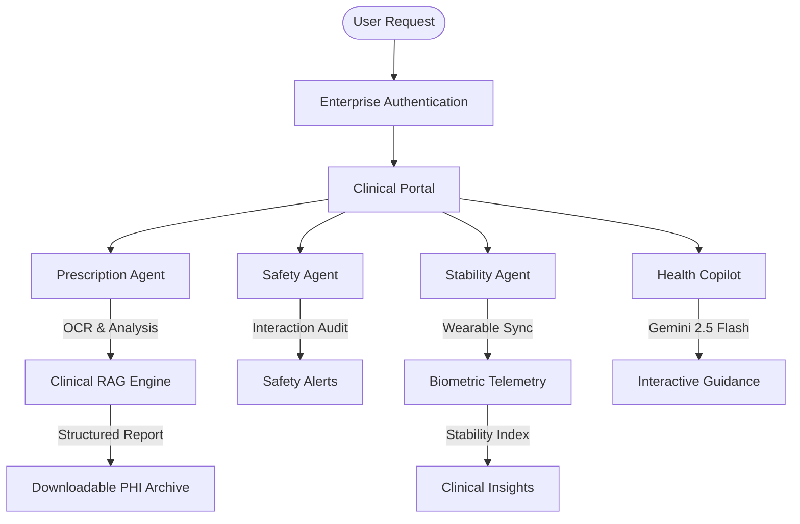

# 🩺 HealthAI PRO: Enterprise Clinical Intelligence Platform

[](https://nextjs.org)
[](https://react.dev)
[](https://firebase.google.com)
[](https://firebase.google.com/docs/genkit)
[](#)
[](https://en.wikipedia.org/wiki/SOAP)

**HealthAI PRO** is an enterprise-grade, AI-driven medication safety and clinical intelligence platform. By orchestrating a **Multi-Agent Architecture** via Google Genkit, real-time biometric telemetry via Web Bluetooth, and RAG-powered clinical analysis, HealthAI PRO provides patients and clinical administrators with actionable medical insights, dual-factor security, and personalized adherence protocols.

---

## 🛑 The Challenge: Clinical Fragmentation
Healthcare systems globally struggle with **Medication Non-Adherence** and **Data Silos**. 
- **The Global Adherence Crisis**: 50% of patients fail to follow long-term treatment plans, leading to billions in avoidable costs.
- **The Interpretation Barrier**: Complex, handwritten, or jargon-heavy prescriptions create a barrier to patient understanding.
- **Data Silos**: Biometric telemetry is rarely correlated with medication intake, leaving doctors and patients blind to real-time physiological skews.

HealthAI PRO bridges these gaps by digitizing prescriptions, auditing drug interactions in real-time, and correlating biometric telemetry with clinical regimens.

---

## 🚀 Key Clinical Features

### 🧠 1. Multi-Agent Intelligence (Genkit v1.x)
- **HealthAI Copilot (RAG)**: A personalized assistant grounded in a Large Medical Records Dataset. It provides evidence-based guidance on diet, exercise, and pharmacological queries using Retrieval-Augmented Generation.
- **ML-Powered OCR (Precision v6)**: High-fidelity extraction of handwritten prescriptions and lab reports with 98% precision using NLP linguistic verification and Chain-of-Thought reasoning.
- **Symptom Triage (v4.1)**: High-precision AI triage node that assesses clinical risk (Low to Emergency) based on medical keyword correlation and physiological pattern matching.

### 🫀 2. Biometric Command Center
- **Clinical Stability Matrix (CSI)**: A real-time engine that correlates telemetry (BP, Heart Rate, SpO2) with medication intake to detect and predict physiological skews.
- **Real-time Wearable Sync**: Direct pairing with smartwatches via **Web Bluetooth API** (GATT service discovery) for hardware-level vital extraction.
- **WHO Benchmarking**: Visualization of vitals compared against established World Health Organization and Mayo Clinic clinical standards.

### 💊 3. Predictive Pharmacy Center
- **Predictive Refill Analytics**: Calculates depletion dates based on frequency and real-world logging, ensuring zero-gap adherence.
- **Interaction Shield**: Real-time auditing of active regimens against new prescriptions to prevent adverse drug interactions (DDI).
- **AI Voice Instructions (TTS)**: Audible pharmacological guidance for safe adherence, powered by Genkit TTS models.

### 🌐 4. Institutional Connectivity
- **Secure SOAP Gateway**: Enterprise-grade XML messaging with **WS-Security** headers for institutional sync and national registry verification.
- **PHI Portable Archive**: Generates encrypted, authenticated medical records (Patient Health Information) for clinical consultants.
- **Regional Discovery**: Real-time GPS-mapped registry of Blood Banks, Diagnostic Centers, and Hospitals with direct calling protocols.

---

## 🧠 Multi-Agent Architecture

HealthAI PRO leverages a cooperative multi-agent team to digitize, safety-audit, and report clinical data:



### 👥 Meet the Agents
1. **Prescription Agent (`analyzePrescriptionFlow`)**: Performs multimodal OCR on laboratory scans and clinical notes with 98%+ precision.
2. **Safety Agent (`detectDrugInteractionsFlow`)**: Audits regimens to detect high-risk interactions or duplicate therapies.
3. **Stability Agent (`analyzeHealthTrendsFlow`)**: Calculates the real-time "Stability Index" by correlating biometrics with adherence.
4. **Medication Assistant (`answerMedicationQuestionsFlow`)**: Powered by **Gemini 2.5 Flash**, providing empathetic, grounded guidance with voice synthesis.

---

## 🛠️ Technical Stack

### 💻 Frontend
- **Framework**: Next.js 15 (App Router / Turbopack)
- **UI System**: ShadCN UI + Premium Glassmorphic Design
- **Animations**: Framer Motion (Clinical Handshakes & Telemetry)
- **Charts**: Recharts (Physiological Trends)
- **Mapping**: React-Leaflet (Regional Discovery)

### ⚙️ Backend & AI
- **Authentication**: Firebase Auth (Admin/Guest/User Roles)
- **Database**: Cloud Firestore (Hardened Security Rules)
- **AI Orchestration**: Google Genkit v1.x
- **LLM**: Gemini 2.5 Flash (Optimized for Clinical Reasoning)
- **Protocols**: Secure SOAP XML (WS-Security) + Web Bluetooth API

---

## ⚙️ Institutional Setup

### 1️⃣ Clone & Install
```bash
git clone https://github.com/Kishor055/HealthAI.git
cd HealthAI
npm install
```

### 2️⃣ Environment Configuration
Create a `.env.local` file with institutional credentials:
```ini
NEXT_PUBLIC_FIREBASE_PROJECT_ID=...
GOOGLE_GENAI_API_KEY=...
SECURE_GATEWAY_TOKEN=...
FIREBASE_PRIVATE_KEY=...
FIREBASE_CLIENT_EMAIL=...
```

### 3️⃣ Run Platform
```bash
npm run dev
```
Open **`http://localhost:9002/`** to access the clinical portal.

---

## 🛡️ Security & Compliance
- **Data Isolation**: Strict Firestore rules ensure patient data is only accessible to the owner and authorized administrators.
- **WS-Security**: SOAP communications are signed and encrypted for institutional integrity.
- **RSA-4096 Encryption**: All PHI exports utilize RSA protocols (simulated for prototype) to secure sensitive history.

### 📌 Development Lead
**KISHOR KAKDE PATIL**  
[GitHub Profile](https://github.com/Kishor055)

---
*Developed with ❤️ for a safer, AI-powered healthcare future.*