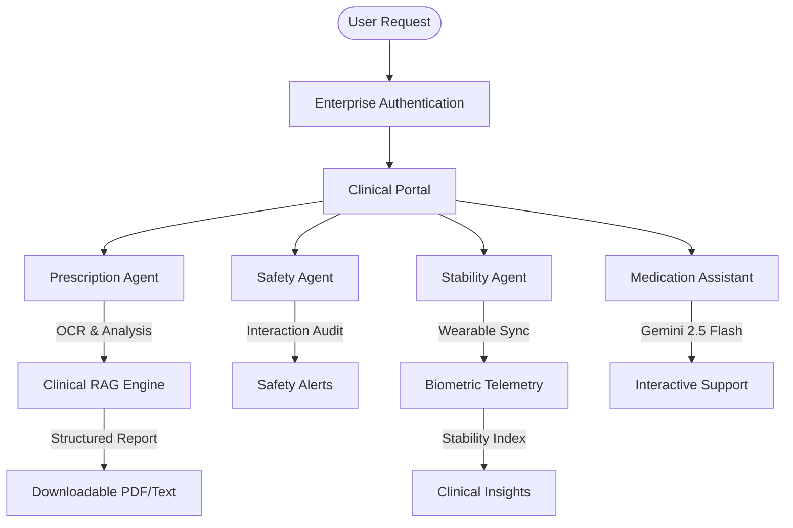

# 🩺 HealthAI PRO

[](https://nextjs.org)
[](https://react.dev)
[](https://firebase.google.com)
[](https://firebase.google.com/docs/genkit)
[](#)

**HealthAI PRO** is an enterprise-grade, AI-driven medication safety and clinical intelligence platform. By coordinating a **Multi-Agent intelligence architecture** via Google Genkit, real-time biometric telemetry, and RAG-powered document analysis, HealthAI PRO provides patients and clinical administrators with actionable medical insights, dual-factor security, and personalized adherence protocols.

---

## 🛑 The Challenge We Solve
Healthcare systems globally struggle with **Medication Non-Adherence** and **Data Fragmentation**. 50% of patients fail to follow long-term treatment plans, leading to billions in avoidable costs and thousands of preventable deaths. 

> **[Read our Full Problem Statement (problem.md)](./problem.md)**

HealthAI PRO addresses these challenges by digitizing prescriptions, auditing drug interactions in real-time, and correlating biometric telemetry with clinical regimens.

---

## 📸 Application Preview

### 📊 Clinical Intelligence Dashboard


*The HealthAI PRO Dashboard aggregates real-time biometric stability, active medication schedules, and AI-driven clinical insights using a premium glassmorphic design system.*

### 🤖 RAG-Powered Prescription Analysis


*The Clinical Registry module utilizes multimodal Genkit flows to perform OCR on prescriptions, running a RAG (Retrieval-Augmented Generation) audit against pharmaceutical databases.*

---

## 🧠 Multi-Agent Architecture & Pipeline

HealthAI PRO leverages a cooperative multi-agent team to digitize, safety-audit, and report clinical data:



### 👥 Meet the Agents
1. **Prescription Agent (`analyzePrescriptionFlow`)**: Performs multimodal OCR on laboratory scans and clinical notes, extracting medication names, dosages, and regimens with 98%+ precision.
2. **Safety Agent (`detectDrugInteractionsFlow`)**: Audits active regimens against newly prescribed drugs to detect high-risk interactions or duplicate therapies.
3. **Stability Agent (`analyzeHealthTrendsFlow`)**: Correlates biometric telemetry (Heart Rate, BP, SpO2) with medication adherence to calculate a real-time "Stability Index."
4. **Medication Assistant (`answerMedicationQuestionsFlow`)**: A professional clinical chatbot powered by **Gemini 2.5 Flash** providing empathetic, evidence-based medication guidance with voice synthesis.

---

## 🛠️ Technical Stack & Dependencies

### 💻 Frontend
- **Framework**: Next.js 15 (App Router)
- **Styling**: Tailwind CSS & ShadCN UI (Clinical Glass Design System)
- **Animations**: Framer Motion
- **Charts**: Recharts (Biometric Visualization)
- **Language**: TypeScript

### ⚙️ Backend & Cloud
- **Authentication**: Firebase Auth (Email/Password + Google)
- **Database**: Cloud Firestore
- **Serverless**: Next.js Server Actions & API Routes
- **Session**: Firebase Admin SDK (Extended Persistent Cookies)

### 🧠 Generative AI
- **Orchestration**: Google Genkit
- **LLM**: Gemini 2.5 Flash
- **Logic**: RAG-based clinical reporting and multimodal OCR

---

## 📂 Project Structure

```bash
HealthAI_PRO/
│
├── src/
│   ├── app/                  # Next.js 15 App Router (Login, Signup, Dashboard)
│   ├── ai/                   # Genkit AI Architecture
│   │   ├── flows/            # Multi-Agent Flows (Prescription, Safety, Trends)
│   │   └── genkit.ts         # AI Engine Configuration
│   ├── firebase/             # Client/Admin SDK & Provider Logic
│   ├── components/           # UI Library (ShadCN + Premium Custom)
│   ├── context/              # Multilingual & Global State Management
│   └── lib/                  # Utilities & Translations (EN, HI, MR)
│
├── docs/                     # Architectural Blueprints
├── firestore.rules           # Enterprise Security Policies
└── README.md                 # Project Documentation
```

---

## ⚙️ Installation & Setup

### 1️⃣ Clone the Repository
```bash
git clone https://github.com/Kishor055/HealthAI.git
cd HealthAI
```

### 2️⃣ Environment Configuration
Create a `.env.local` file with your clinical credentials:
```ini
# Firebase Config
NEXT_PUBLIC_FIREBASE_API_KEY=your_api_key
NEXT_PUBLIC_FIREBASE_PROJECT_ID=your_project_id

# Firebase Admin (Server-side)
FIREBASE_CLIENT_EMAIL=your_service_account_email
FIREBASE_PRIVATE_KEY="your_private_key"

# AI Engine
GOOGLE_GENAI_API_KEY=your_gemini_api_key
```

### 3️⃣ Run the Platform
```bash
npm install
npm run dev
```
Open **`http://localhost:9002/`** to access the clinical portal.

---

## 📈 Use Cases & Clinical Impact

- 💊 **Medication Safety**: Prevents adverse drug reactions through AI-driven interaction audits.
- 📋 **Record Digitization**: Converts handwritten or scanned prescriptions into structured history.
- 🫀 **Biometric Oversight**: Tracks patient stability using wearable-synced telemetry.
- 🌍 **Universal Access**: Full support for **English, Hindi, and Marathi** for diverse patient demographics.

---

## ⭐ Support & Contributions

HealthAI PRO is built for clinical safety and patient empowerment.
1. Fork the project.
2. Create a clinical feature branch (`git checkout -b feature/NewProtocol`).
3. Commit changes (`git commit -m 'Add NewProtocol'`).
4. Open a Pull Request.

---

### 📌 Development Lead
**KISHOR KAKDE PATIL**  
[GitHub Profile](https://github.com/Kishor055)

---
*Developed with ❤️ for a safer, AI-powered healthcare future.*
