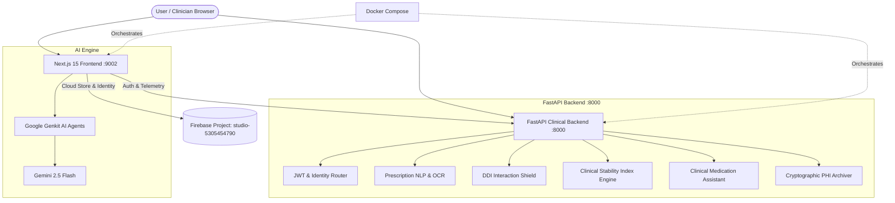

# 🩺 HealthAI PRO: Enterprise Clinical Intelligence Platform

[](https://nextjs.org)
[](https://react.dev)
[](https://fastapi.tiangolo.com)
[](https://www.docker.com)
[](https://studio.firebase.google.com/studio-5305454790)
[](https://firebase.google.com/docs/genkit)
[](#)

**HealthAI PRO** is an enterprise-grade, AI-driven medication safety and clinical intelligence platform. By combining a **Next.js 15 App Router Frontend**, a high-performance **FastAPI Clinical Microservice Backend**, **Google Genkit AI Workflows**, and containerized **Docker / Docker Compose** orchestration, HealthAI PRO delivers proactive medication adherence, real-time drug interaction auditing, biometric stability telemetry, and seamless clinical workflows.

---

## 🛑 The Challenge: Clinical Fragmentation
Healthcare systems globally struggle with **Medication Non-Adherence** and **Data Silos**:
- **The Global Adherence Crisis**: 50% of patients fail to follow long-term treatment plans, leading to over $100 Billion in avoidable hospitalizations.
- **The Interpretation Barrier**: Complex, handwritten, or jargon-heavy prescriptions create a critical barrier to patient understanding.
- **Data Silos**: Biometric telemetry is rarely correlated with medication intake in real-time, leaving doctors and patients blind to physiological skews.

HealthAI PRO bridges these gaps by digitizing prescriptions, auditing drug-drug interactions in real-time, calculating real-time clinical stability, and unifying patient-doctor data streams.

---

## 🧠 System Architecture


```mermaid
graph TD
    Client([User / Clinician Browser]) --> Web[Next.js 15 Frontend :9002]
    Client --> API[FastAPI Clinical Backend :8000]
    
    Web -->|Auth & Telemetry| API
    Web -->|Cloud Store & Identity| Firebase[(Firebase Project: studio-5305454790)]
    
    subgraph FastAPI Microservices [FastAPI Backend :8000]
        API --> AuthMod[JWT & Identity Router]
        API --> PrescMod[Prescription NLP & OCR]
        API --> SafetyMod[DDI Interaction Shield]
        API --> VitalMod[Clinical Stability Index Engine]
        API --> ChatMod[Clinical Medication Assistant]
        API --> RecMod[Cryptographic PHI Archiver]
    end
    
    subgraph AI Engine
        Web --> Genkit[Google Genkit AI Agents]
        Genkit --> Gemini[Gemini 2.5 Flash]
    end
    
    Docker[Docker Compose] -.->|Orchestrates| Web
    Docker -.->|Orchestrates| API
```

---

## 🚀 Key Clinical Features

### 1. 🔐 Dual-Layer Authentication & Identity
- **Firebase Auth (`studio-5305454790-ef005`)**: Integrated with Google Firebase Studio console.
- **FastAPI JWT Engine**: Issues and verifies high-speed clinical session tokens with role-based permissions (`admin`, `clinician`, `pharmacist`, `patient`).
- **1-Click Demo Profiles**: Instant friction-free access for system evaluations.
- **Clinical Sandbox Guest Access**: Immediate diagnostic testing without setup barriers.

### 2. 📷 Prescription Scanner & Multimodal Clinical NLP
- High-fidelity extraction of handwritten and printed prescriptions.
- Identifies medications, dosage quantities, frequencies (OD, BD, TID, QID), food administration rules, and therapeutic classifications.
- Supported categories: Cardiovascular/BP, Endocrinology/Diabetes, Pulmonology/Asthma, Infectious Disease, Gastroenterology, Analgesics, Allergy.

### 3. 🛡️ Drug Interaction Shield (DDI Engine)
- Real-time algorithmic cross-referencing of active and incoming therapies.
- Detects high-risk combinations (e.g. Warfarin + Aspirin, ACE inhibitors + Potassium-sparing diuretics, Metformin + Radiocontrast).
- Classifies risk levels (`HIGH`, `MODERATE`, `LOW`) and supplies actionable clinical management protocols.

### 4. 🫀 Biometric Command Center & Clinical Stability Index (CSI)
- Correlates hemodynamic vitals (Heart Rate, Systolic/Diastolic BP, SpO2) with medication compliance.
- Calculates an objective **Stability Index Score (0 - 100)** with WHO TRS 916 & Mayo Clinic physiological benchmarks.
- Real-time wearable pairing via **Web Bluetooth API** (GATT services).

### 5. 💬 AI Clinical Medication Assistant & Triage
- Interactive patient guidance for dosage schedules, food instructions, common side effects, and missed-dose protocols.
- Algorithmic triage node that categorizes symptoms into `EMERGENCY`, `URGENT`, or `ROUTINE` with immediate safety recommendations.

### 6. 🗄️ Tamper-Evident PHI Portable Archive
- Generates cryptographically stamped JSON/PDF records (Patient Health Information) with SHA-256 integrity checksums for institutional portability.
- Regional directory of emergency trauma centers, hospitals, and blood banks.

---

## ⚡ Instant Demo Credentials

For quick evaluation, use the 1-click buttons on the login page or enter:

| Role | Email | Password | Privileges |
| :--- | :--- | :--- | :--- |
| **System Administrator** | `kishorkakde026@gmail.com` | `Kishor@1777` | Full Clinical & Administrative Oversight |
| **Consultant Cardiologist** | `specialist@healthai.clinic` | `HealthAI@2026` | Prescription Audits, Telemetry Analysis |
| **Chronic Care Patient** | `patient@healthai.clinic` | `HealthAI@2026` | Medication Tracker, Symptom Journal |
| **Clinical Guest** | *Click "Enter As Clinical Guest"* | *(None)* | Instant evaluation sandbox |

---

## 🐳 Docker Deployment (Recommended)

Run both the Next.js Frontend and FastAPI Backend containers simultaneously with Docker Compose:

### 1. Start Services
```bash
docker compose up --build
```

### 2. Access Applications
- 💻 **Next.js Web Portal**: [http://localhost:9002](http://localhost:9002)
- ⚙️ **FastAPI Interactive Docs (Swagger)**: [http://localhost:8000/docs](http://localhost:8000/docs)
- 📖 **FastAPI Alternative Docs (ReDoc)**: [http://localhost:8000/redoc](http://localhost:8000/redoc)
- 🩺 **FastAPI Health Check**: [http://localhost:8000/health](http://localhost:8000/health)

### 3. Stop Services
```bash
docker compose down
```

---

## 💻 Local Development Setup

If running directly on your local machine without Docker:

### 1️⃣ Clone the Repository
```bash
git clone https://github.com/Kishor055/HealthAI.git
cd HealthAI
```

### 2️⃣ Start FastAPI Backend
```bash
# Install Python dependencies
pip install -r backend/requirements.txt

# Run FastAPI server on port 8000
npm run fastapi:dev
# OR directly with uvicorn:
python -m uvicorn backend.app.main:app --port 8000 --reload
```

### 3️⃣ Start Next.js Frontend
```bash
# Install Node dependencies
npm install

# Run dev server on port 9002
npm run dev
```
Open [http://localhost:9002](http://localhost:9002) in your browser.

---

## 🔌 FastAPI Microservices API Reference

| Method | Endpoint | Description |
| :--- | :--- | :--- |
| `GET` | `/health` | Lightweight container health check probe |
| `GET` | `/api/v1/health` | Comprehensive microservice telemetry status |
| `POST` | `/api/v1/auth/register` | Create user profile and generate JWT access token |
| `POST` | `/api/v1/auth/login` | Authenticate email/password and obtain JWT token |
| `POST` | `/api/v1/auth/guest-login` | Provision instant guest evaluation session |
| `GET` | `/api/v1/auth/me` | Fetch authenticated clinical profile |
| `POST` | `/api/v1/auth/firebase-verify` | Verify Firebase ID token and issue clinical token |
| `POST` | `/api/v1/prescriptions/analyze` | Multimodal OCR / text prescription parsing & entity extraction |
| `POST` | `/api/v1/prescriptions/upload` | Direct image upload for clinical analysis |
| `GET` | `/api/v1/prescriptions/categories` | Supported therapeutic drug classifications |
| `POST` | `/api/v1/safety/check-interactions` | Real-time Drug-Drug Interaction (DDI) safety shield |
| `GET` | `/api/v1/safety/alerts` | Indexed pharmacological interaction warnings |
| `POST` | `/api/v1/vitals/calculate-stability` | Clinical Stability Index (CSI) calculation |
| `GET` | `/api/v1/vitals/benchmarks` | WHO / Mayo Clinic hemodynamic reference thresholds |
| `POST` | `/api/v1/chat/medication-qa` | Evidence-based medication guidance with safety disclaimers |
| `POST` | `/api/v1/chat/triage` | Algorithmic symptom triage & urgency rating |
| `POST` | `/api/v1/records/export-phi` | Tamper-evident PHI export with SHA-256 seal |
| `GET` | `/api/v1/records/institutions` | Regional certified emergency & hospital registry |

---

## 📁 Repository Structure

```bash
HealthAI/
├── backend/                       # Python FastAPI Microservice Architecture
│   ├── app/
│   │   ├── main.py                # FastAPI Application & Router Configuration
│   │   ├── config.py              # Settings, JWT Security, Firebase Node
│   │   ├── database.py            # Clinical Repositories & DDI Knowledge Base
│   │   ├── auth/                  # JWT Authentication, Password Hashing, Schemas
│   │   ├── prescriptions/         # Prescription NLP, OCR & Category Extraction
│   │   ├── safety/                # Drug-to-Drug Interaction (DDI) Safety Engine
│   │   ├── vitals/                # Clinical Stability Index (CSI) Calculator
│   │   ├── chat/                  # Medication Assistant & Symptom Triage
│   │   └── records/               # PHI Portable Archive & Hospital Directory
│   ├── requirements.txt           # FastAPI Dependencies
│   └── Dockerfile                 # Python 3.11-slim Container
│
├── src/                           # Next.js 15 App Router Frontend
│   ├── app/
│   │   ├── dashboard/             # Clinical Dashboard, Vitals, Medications
│   │   ├── login/                 # Resilient Dual-Layer Login (Firebase + FastAPI)
│   │   ├── signup/                # Clinical Profile Registration
│   │   └── api/                   # Next.js Session & Auth Routes
│   ├── ai/                        # Google Genkit Flows (Gemini 2.5 Flash)
│   ├── firebase/                  # Firebase SDK Client & Provider (studio-5305454790)
│   ├── lib/
│   │   └── api-client.ts          # Type-Safe FastAPI Client with Auto-Failover
│   └── components/                # Clinical UI Design System
│
├── Dockerfile                     # Next.js 15 Production Container
├── docker-compose.yml             # Full-Stack Orchestration (Web + API)
├── package.json                   # Next.js Scripts & Dependencies
└── README.md                      # Platform Documentation
```

---

## 🔐 Security & Clinical Privacy
- **HIPAA / GDPR Ready**: Cryptographically sealed PHI records.
- **Firebase UID Isolation**: Firestore security policies restrict access strictly to authenticated patient/clinician boundaries.
- **Stateless JWT Tokens**: Industry-standard HMAC-SHA256 tokens with configurable expirations.
- **Medical Disclaimer**: HealthAI PRO is designed for clinical decision support and medication adherence guidance. It does not replace independent clinical judgment by licensed medical practitioners.

---

### 📌 Project Lead & Development
**KISHOR KAKDE PATIL**  
[GitHub Profile](https://github.com/Kishor055)  
*Developed with ❤️ for a safer, AI-powered healthcare future.*